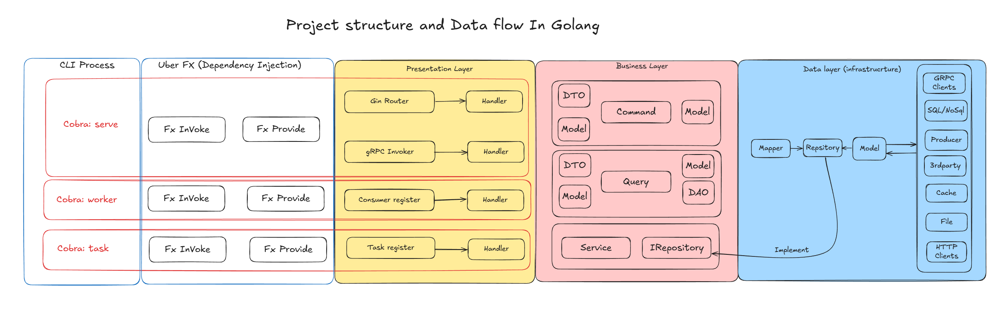
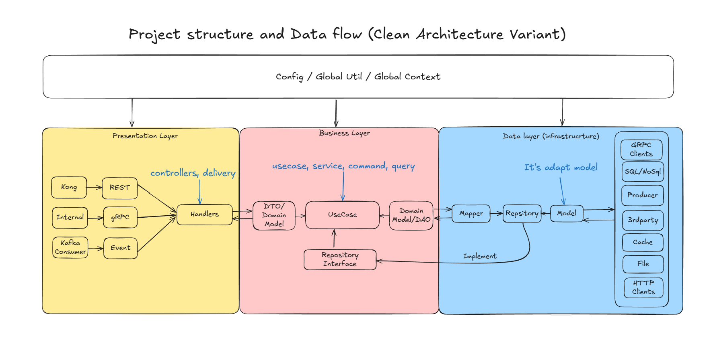

# Beetool.Dev - Golang Clean Architecture

A Go application built with Clean Architecture principles, dependency injection (Uber FX), Gin, GORM, and optional Redis/Valkey, RabbitMQ, and OpenTelemetry.

## Overview

The project follows Domain-Driven Design and separation of concerns with layers: Domain, Application, Infrastructure, and Presentation.

## Project Structure



See [ai-docs/STRUCTURE.md](ai-docs/STRUCTURE.md) for the full directory tree and layer mapping. API prefixes and routes: [ai-docs/API-STRUCTURE.md](ai-docs/API-STRUCTURE.md).

## Architecture



- **Domain**: Entities, value objects, repository interfaces, domain errors
- **Application**: Commands, queries, DTOs
- **Infrastructure**: Persistence (GORM), external services
- **Presentation**: HTTP handlers, route registration

## Features

- Clean Architecture with DDD-style modules (auth, note, user)
- Dependency injection with Uber FX
- REST API with Gin and Swagger
- GORM with Postgres, MySQL, SQLite, SQL Server
- Optional: Redis/Valkey (cache_comp), RabbitMQ (rabbitmq_comp), OpenTelemetry (otel_comp)
- Role-based access (Viewer, Editor, Admin)
- Migrations: Atlas (schema diff) + Goose (run SQL)

## Prerequisites

- Go 1.25.1+
- PostgreSQL 16+ (default; others supported via GORM)
- Docker (optional): Postgres, Valkey, RabbitMQ, observability stack

## Installation

1. Clone and enter the repo:

```bash
git clone https://github.com/dukk308/beetool.dev-go-starter.git
cd golang-clean-arc
```

2. Install dependencies:

```bash
go mod download
```

3. Copy env and set DB:

```bash
cp .env.example .env
```

Edit `.env`: `DB_DSN`, `DB_DSN_SHADOW` (for Atlas), and any other flags (see `go run main.go outenv`).

4. Start local infra (optional):

```bash
cd deployment/local
docker-compose -f docker-compose.infras.yml up -d
```

5. Run migrations:

```bash
make migration-up
```

6. Start the server:

```bash
go run main.go serve
```

Server listens on port `8080` by default (`GIN_PORT` / `-gin-port`).

## Usage

### Commands

- `go run main.go serve` — start HTTP server
- `go run main.go worker` — start worker (if used)
- `go run main.go outenv` — print env/flag help

### Local infra (Docker)

| Compose file | Services |
|--------------|----------|
| `deployment/local/docker-compose.infras.yml` | Postgres, Valkey, RabbitMQ |
| `deployment/local/docker-compose.o11y.yml` | Alloy, Prometheus, Tempo, Grafana |

## Development

### Required tools

| Tool | Purpose | Install |
|------|---------|--------|
| **atlas** | Schema diff and migration validation (atlas.hcl + GORM) | `go install ariga.io/atlas/cmd/atlas@latest` |
| **goose** | Run SQL migrations | `go install github.com/pressly/goose/v3/cmd/goose@latest` |
| **dlv** | Debugger (Connect to Air Debugger on port 2345) | `go install github.com/go-delve/delve/cmd/dlv@latest` |
| **air** (optional) | Hot reload | `go install github.com/air-verse/air@latest` |

Check versions: `atlas version`, `goose -version`, `dlv version`, `air -v`.

### Migrations (Atlas + Goose)

- Create migration: `make migration-create-<name>`
- Generate from GORM: `make migration-gen-<name>` (needs `DB_DSN`, `DB_DSN_SHADOW` in `.env`)
- Apply: `make migration-up`
- Rollback one: `make migrate-down-1`
- Status/validate: `make migration-status`, `make migration-validate`

### Swagger

Regenerate API docs after changing handlers:

```bash
make swag
```

### Debugging with Air

1. Run Air: `air` or **Run Task → Run Air (serve)** (or **Run Air (worker)**).
2. Start debug: **Run and Debug → Connect to Air Debugger** (F5).
3. Optional: install [vscode-go-air-reconnect](https://github.com/dukk308/vscode-go-air-reconnect-ext) so the debugger re-attaches after Air rebuilds.

### Layer guidelines

- **Domain** (`internal/modules/*/domain/`): Entities, repos interfaces, no framework deps
- **Application** (`internal/modules/*/application/`): Use cases, commands/queries, DTOs
- **Infrastructure** (`internal/modules/*/infrastructure/`): Repo implementations, DB, external APIs
- **Presentation** (`internal/modules/*/presentation/`): HTTP handlers, routing

### Adding a feature

1. Add a module under `internal/modules/<name>/` with domain, application, infrastructure, presentation.
2. Register it in `internal/modules/fx_features.go`.
3. Wire routes in the module’s presentation layer.

## Configuration

- **App config**: `internal/config/` (e.g. auth secrets).
- **Flags / env**: see `.env.example` and `go run main.go outenv`. Examples: `-db-dsn`, `-gin-port`, `-rabbitmq-url`, `-redis-addrs`, etc.

### Google OAuth

To enable Google OAuth login:

1. **Create OAuth credentials** in [Google Cloud Console](https://console.cloud.google.com/apis/credentials):
   - Create OAuth 2.0 Client ID
   - Add authorized redirect URI: `http://localhost:8080/v1/auth/google/callback`
   - Copy Client ID and Client Secret

2. **Set environment variables** or use flags:

```bash
# Environment variables
export GOOGLE_CLIENT_ID="your-client-id"
export GOOGLE_CLIENT_SECRET="your-client-secret"
export GOOGLE_REDIRECT_URL="http://localhost:8080/v1/auth/google/callback"

# Or use flags
go run main.go serve \
  -google-client-id="your-client-id" \
  -google-client-secret="your-client-secret" \
  -google-redirect-url="http://localhost:8080/v1/auth/google/callback"
```

3. **Optional custom endpoints** (defaults work for most cases):

```bash
go run main.go serve \
  -google-auth-url="https://accounts.google.com/o/oauth2/v2/auth" \
  -google-token-url="https://oauth2.googleapis.com/token" \
  -google-user-info-url="https://www.googleapis.com/oauth2/v2/userinfo" \
  -google-scopes="https://www.googleapis.com/auth/userinfo.email,https://www.googleapis.com/auth/userinfo.profile"
```

4. **API endpoints**:
   - `GET /v1/auth/google/url` - Get Google OAuth URL (returns `{"url": "..."}`)
   - `POST /v1/auth/google/signin` - Exchange code for tokens `{"code": "..."}`

**Note:** If using Google OAuth in production, update the redirect URL in Google Cloud Console to match your production domain.

## Docker

### Local infra only

```bash
cd deployment/local
docker-compose -f docker-compose.infras.yml up -d
```

### Production build

```bash
cd deployment/production
docker build -t golang-clean-arc .
docker run -p 8080:8080 golang-clean-arc
```

## Dependencies

- [Gin](https://github.com/gin-gonic/gin) — HTTP framework
- [GORM](https://gorm.io/) — ORM
- [Uber FX](https://github.com/uber-go/fx) — Dependency injection
- [Cobra](https://github.com/spf13/cobra) — CLI
- [Swag](https://github.com/swaggo/swag) — Swagger
- [amqp091-go](https://github.com/rabbitmq/amqp091-go) — RabbitMQ client
- [go-redis](https://github.com/redis/go-redis) — Redis/Valkey
- [OpenTelemetry](https://opentelemetry.io/) — Tracing (otel_comp)

## License

MIT License.
